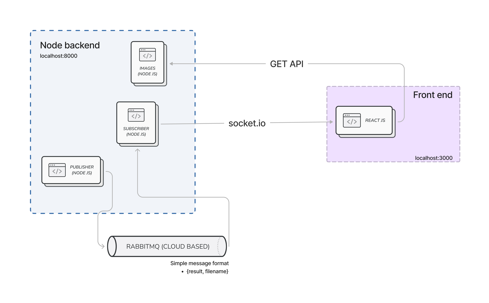

[](https://github.com/simonholmes001/react-client-microservice)


# React Client Microservice
React client communicating with a node backend through [socket.io](https://socket.io/). The node backend receives messages through a [Rabbitmq](https://www.rabbitmq.com/) message brocker, which then transfers this same informaiton to the Client through the socket.io connection. Finally, the Client recovers information based on the received message, and displays the correspinding information through a GET request to the backend.

## Contents
### [Architecture](#architecture-1)
### [Run the code](#run-the-code-1)
- #### [As individual services](#as-individual-services-1)
- #### [Using Docker](#using-docker-1)
- #### [Run tests](#run-tests-1)
### [To Do](#to-do-1)
<!-- &nbsp; -->
<!-- &nbsp; -->

## Architecture


## Run the code

&nbsp;
### As individual services
```markdown
cd backend
npm start
cd ../react_client
npm start
```
The backend runs on `localhost:8000` and teh Client on `localhost:3000`
&nbsp;
### Using Docker
To run from Docker, start the container by running
```markdown
docker-compose up
```
To stop the container run 
```markdown
docker-compose down
``` 
&nbsp;
### Run tests
For the back end only
```markdown
cd backend
npm test
```
&nbsp;

## To Do

- [ ] Complete tests for backend